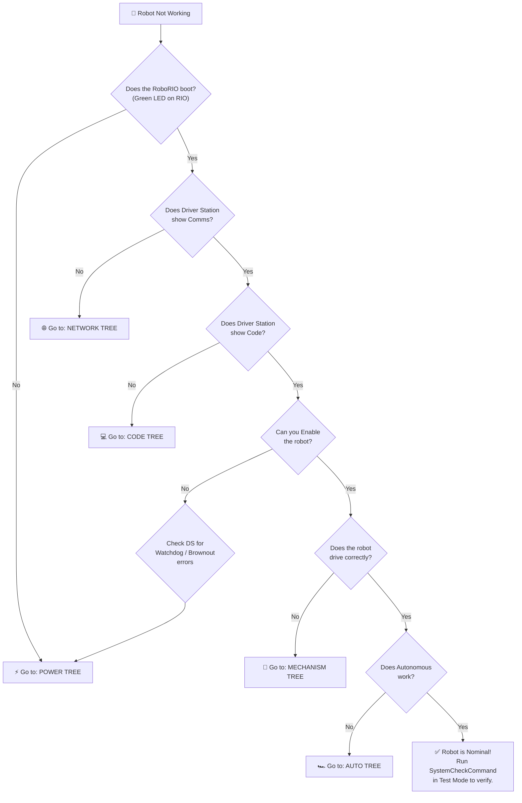
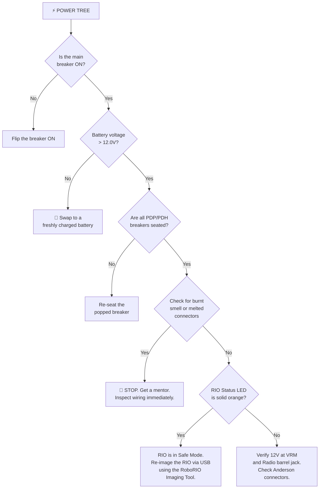
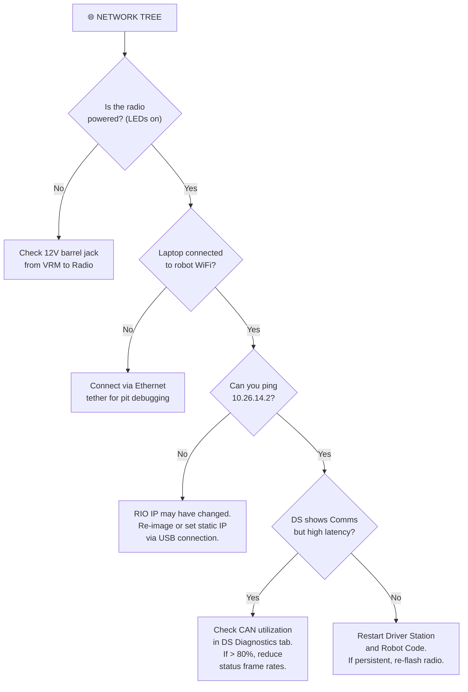
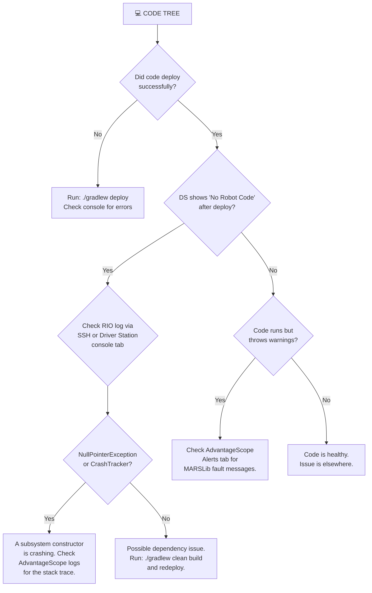
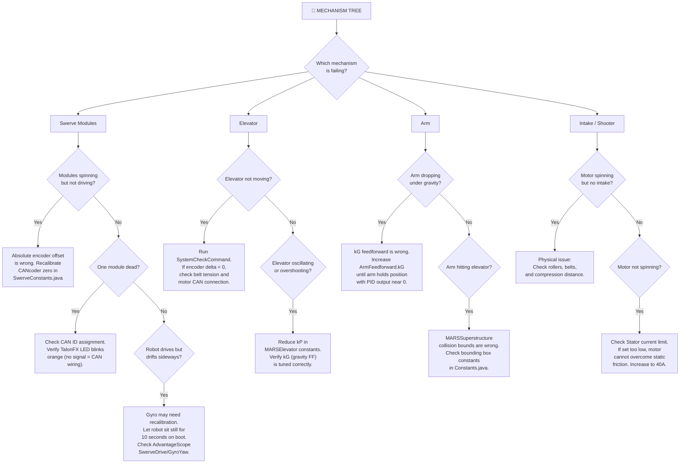
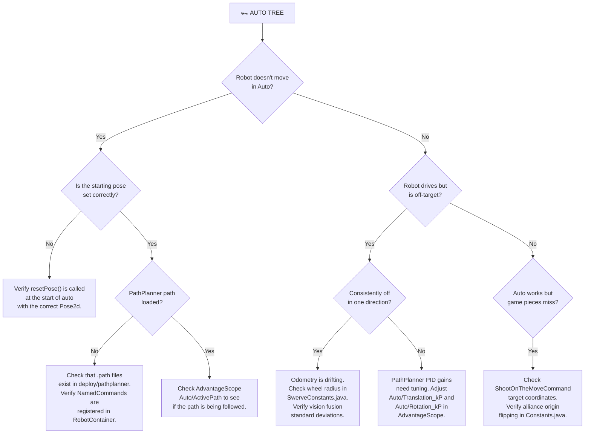

# 🔧 MARSLib Pit Debugging Flowchart — Team 2614

Use this guide when the robot is misbehaving in the pits. Start at the top and follow the arrows.

---

## Master Triage

---

## ⚡ Power Tree

---

## 🌐 Network Tree

---

## 💻 Code Tree

---

## 🦾 Mechanism Tree

---

## 🏎️ Auto Tree

---

## Quick Reference Checklist

| Step | Action | Time |
|------|--------|------|
| 1 | Swap to a fresh battery (>12.5V) | 30s |
| 2 | Tether via Ethernet, verify Comms | 15s |
| 3 | Deploy code: `./gradlew deploy` | 45s |
| 4 | Enable in Test Mode, run `SystemCheckCommand` | 10s |
| 5 | Check AdvantageScope Alerts tab | 5s |
| 6 | Enable Teleop, verify all axes drive correctly | 15s |
| 7 | Run Auto routine on practice field | 30s |

> [!TIP]
> **Total pit turnaround target: under 3 minutes.** If you can't diagnose in 3 minutes, swap the battery and call a mentor.

> [!CAUTION]
> **NEVER enable the robot on blocks in the pit with mechanisms that could swing or extend.** Always have a spotter and ensure the e-stop is within arm's reach.
