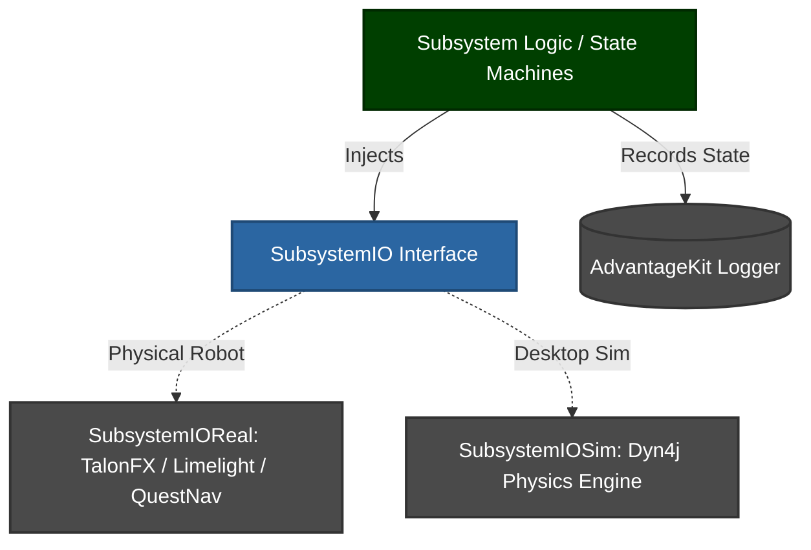

<div align="center">

# 🪐 MARSLib
### Elite FRC AdvantageKit Abstraction & Physics Template

[](https://github.com/thehomelessguy/MARSLib/actions/workflows/ci.yml)
[](https://github.com/thehomelessguy/MARSLib/actions/workflows/ci.yml)
[](https://github.com/thehomelessguy/MARSLib/actions/workflows/ci.yml)
[](https://github.com/diffplug/spotless)
[](https://www.thebluealliance.com/team/2614)
[](https://github.com/Mechanical-Advantage/AdvantageKit)
[](https://dyn4j.org/)

**A championship-tier software template for FRC Team 2614.**
</div>

---

Welcome to MARSLib, an aggressively hardened framework that enables pure, deterministic AdvantageKit logging while bridging seamless 2D physics simulations via `dyn4j`.

This architecture is built so that students can develop completely offline. Our simulation logic doesn't just run mathematical encoders—it simulates hexagonal REBUILT obstacles, voltage sag limits, and bounding box superstructure collisions.

## 🚀 Key Features

*   **100% Simulated Logic:** Run `./gradlew simulateJava` and visualize your robot mathematically navigating the REBUILT field before you even touch a real battery.
*   **Time-Of-Flight Aiming:** Native quadratic kinematic intersections mean the robot shoots accurately while pulling full-speed swerve maneuvers.
*   **Ghost Manager:** Press a button to record your entire teleop driving sequence to disk. Press another to play it perfectly back into PathPlanner as an autonomous macro.
*   **Voltage Load-Shedding:** A native Stator Current allocation daemon statically bounds TalonFX modules to actively prevent robotic brownouts when pushing against defense.
*   **Continuous Automation:** Every push to GitHub runs a spotless lint check and validates physics-backed JUnit tests against the dyn4j simulation engine before compiling and logging an uploadable JAR.

## 🧬 Architecture Diagram

The codebase strictly enforces the AdvantageKit **Dependency Injection** pattern, isolating the logical robot from the physical/simulated hardware.



## 📂 Repository Layout

```text
MARSLib/
├── .github/                 # CI Pipelines, Dependabot, and PR Templates
├── .wpilib/                 # FRC 2614 Team Radio Configurations
├── com.marslib/             # Inner Architecture (Do Not Edit Routine Logic Here)
│   ├── auto/                # GhostManager Macro Recording & Playback
│   ├── faults/              # MARSFaultManager & Alert System
│   ├── mechanisms/          # Linear/Rotary/Flywheel IO Abstractions
│   ├── power/               # MARSPowerManager Load-Shedding Daemon
│   ├── simulation/          # Dyn4j World Bounds and Hexagonal Meshes
│   ├── swerve/              # 250Hz Odometry Thread & Odometry Computations
│   ├── util/                # Time-Of-Flight Interpolation, State Machines, Alliance Utils
│   └── vision/              # AprilTag & SLAM Fusion Pipelines
└── frc.robot/               # Competition Logic (Edit Your Logic Here!)
    ├── commands/            # PathPlanner routines and Teleop Commands
    ├── constants/           # All tunable parameters (Vision, Field, Shooter, etc.)
    ├── simulation/          # Game Piece Physics Bodies
    ├── subsystems/          # Implementations of your Superstructure/Arm
    └── RobotContainer.java  # Controller Mapping and Subsystem bindings
```

## 🛠 Usage & Setup

### 1. Developer Formatting
To ensure your code never gets rejected by GitHub's automated CI, run the included batch script to initialize a spotless Git Hook!
```bash
# Windows
.\install-git-hooks.bat
```
*(This forces your VS Code to auto-format `build.gradle` structures before you push!)*

### 2. Creating Subsystems
MARSLib abstracts the `Real` hardware from the `Sim` hardware using pure Dependency Injection interfaces.
1. `SubsystemIO` - The Interface (What data does this mechanism need?)
2. `SubsystemIOReal` - The Hardware (TalonFX / CANSparkMax / NavX)
3. `SubsystemIOSim` - The Physics (Dyn4j wrappers, friction calculations)

### 3. Firing up AdvantageScope
Want to analyze a bug or watch your ghost-mode playback?
1. Open AdvantageScope
2. Click `File > Open Layout` and select the `advantagescope_layout.json` located at the root of this repository!
3. You now have a fully operational 3D Dashboard monitoring battery voltage limits alongside Hexagonal Field boundaries.

## 🐛 Found a Bug?
Use our customized [GitHub Issue Templates](.github/ISSUE_TEMPLATE) to let the software leads know exactly what went wrong in your simulation or physical robot code! Whether it's a new PathPlanner routine request or an odometry jitter bug, the templates will automatically guide you through attaching your `.wpilog` telemetry data.

## ⚖️ Open Source Acknowledgements
This mathematical architecture leverages the shoulders of giants. We explicitly attribute and bundle the following open-source resources according to their respective MIT/BSD constraints:
- [Mechanical Advantage (AdvantageKit)](AdvantageKit-License.md)
- [WPILib Core](WPILib-License.md)
- [Dyn4j Collision Physics](Dyn4j-License.md)
- [PathPlanner](PathPlanner-License.md)
